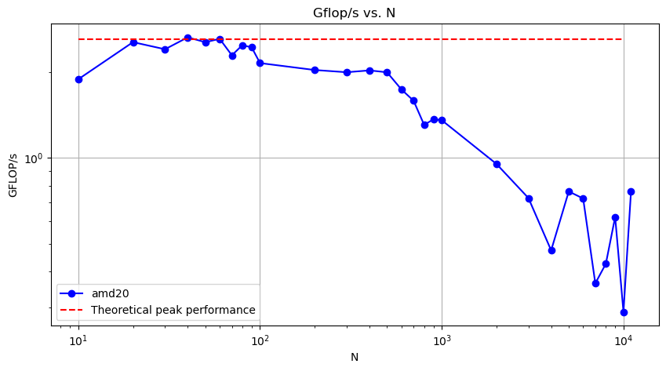
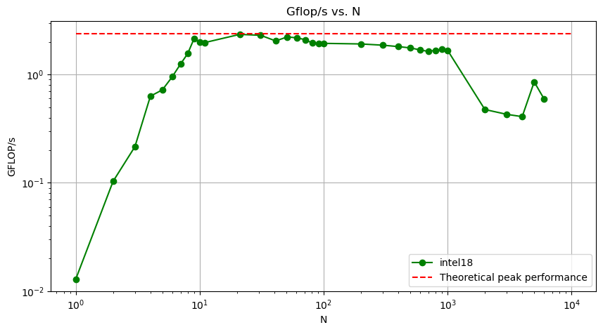
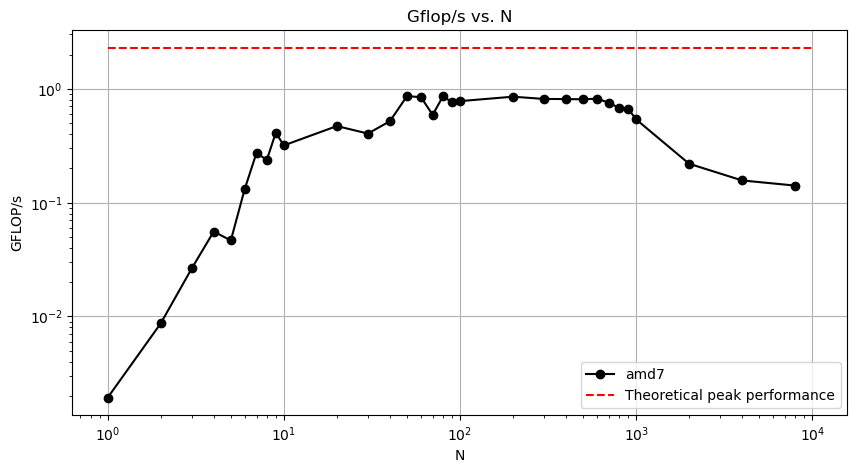
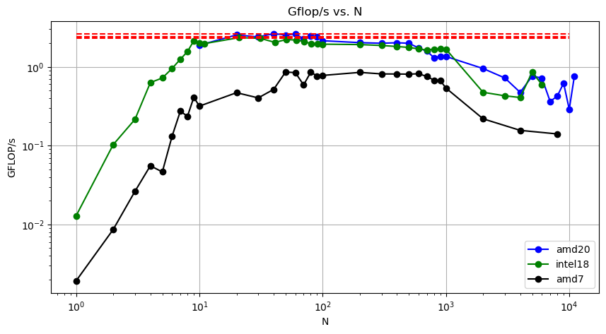
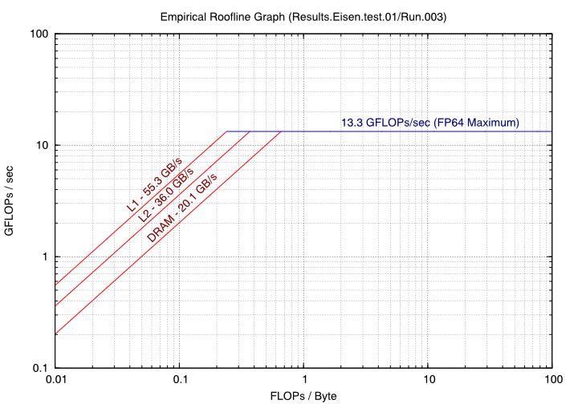
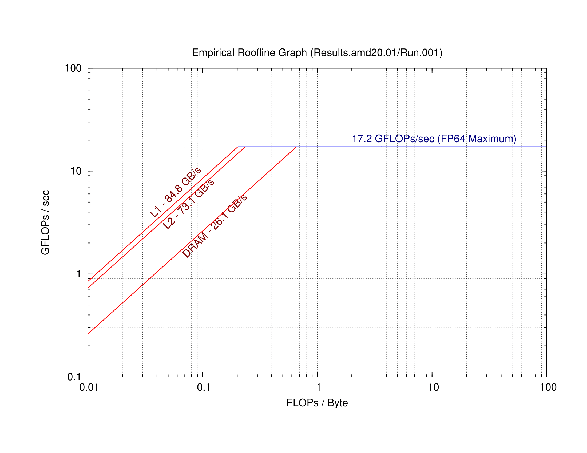
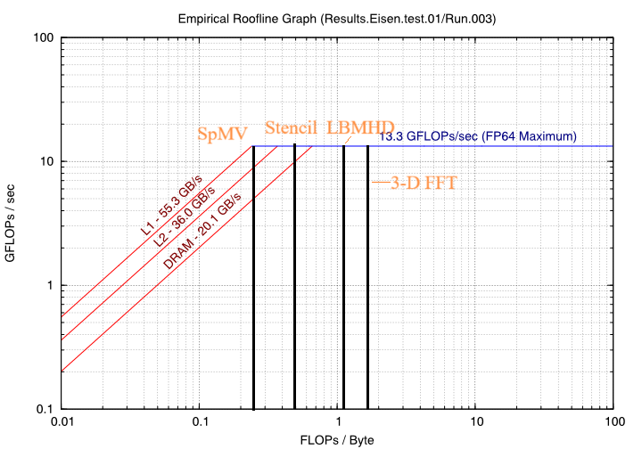
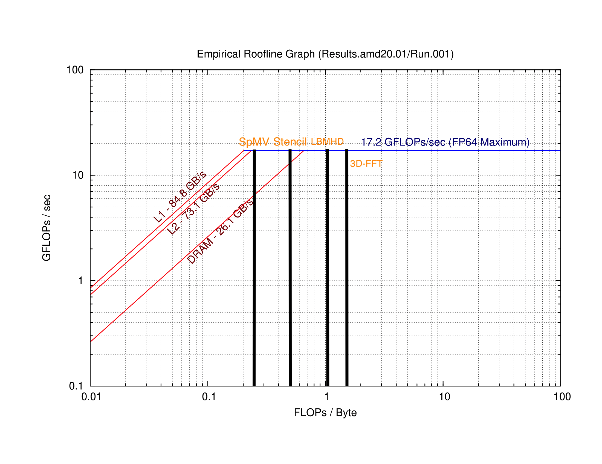
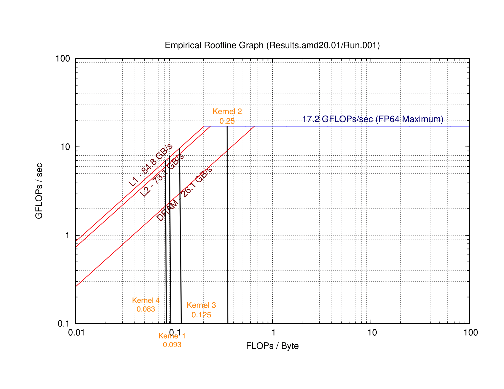
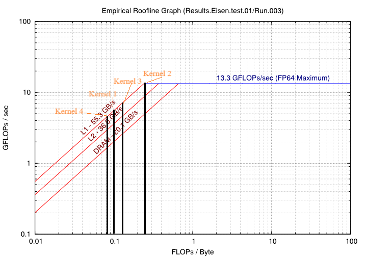

## Warm-up

Computing arithmetic intensity for given compute kernels. 

```C
  Y[j] += Y[j] + A[j][i] * B[i]
```

```C
  s += A[i] * A[i]
```

```C
  s += A[i] * B[i]
```

```C
  Y[i] = A[i] + C*B[i]
```

|kernels| Operations | Load | Write | Arithmetic intensities |
|:-:|:----------:|:----:|:-----:|:----------------------:|
| Y[j] += Y[j] + A[j][i] * B[i] |      3     |   3  |   1   |     3/(4*8) = 3/32     |
| s += A[i] * A[i] |      2     |   1  |   0   |      2/(1*8) = 1/4     |
| s += A[i] * B[i] |      2     |   2  |   0   |      2/(2*8) = 1/8     |
| Y[i] = A[i] + C*B[i] |      2     |   2  |   1   |     2/(3*8) = 1/12     |


## part 1
### 1. 

```
for (int i = 0; i < r1; i++) {
        for (int k = 0; k < c2; k++) {
            for (int j = 0; j < c1; j++) {
                answer[i][k] += Array1[i][j] * Array2[j][k];
            }
        }
    }
```

### 2. 
In the innermost line of the loops, there are two floating point operations. This line is executed $N^3$
 times. Therefore, the total number of flop is $2N^3-N^2$
.

### 3.
This part of the code averages measured run time for iterations :

```
    double average_elapsed_time = total_elapsed_time / num_iterations;

    // Calculate performance in Gflop/s
    double total_ops = 2.0 * N * N * N; // Total ops for all iterations
    double gflops = (total_ops / average_elapsed_time) * 1e-9;
```

- For Amd20 in the HPCC the average performance was 2147.18 Mflops/s for N = 100. 
- For Intel18 in the HPCC the average performance was 1943.09 Mflops/s for N = 100. 
- For Amd7 in the PC the average performance was 779.010 Mflops/s for N = 100. 


### 4. 

One node on HPCC have been selected for this project. The specifications of this one CPU can be found in the following table:

| CPU                             | clock speed | L1 cache size | L2 cache size | L3 cache size | Number of cores per socket |
|:-------------------------------:|:-----------:|:-------------:|:-------------:|:-------------:|:--------------------------:|
| AMD EPYC 7H12 64-Core Processor    | $2.6$ GHz   | $32$ KB       | $512$ KB      | $16$ MB       | 64                         |
| Intel(R) Xeon(R) Gold 6148 20-Core Processor    | $2.4$ GHz  | $32$ KB       | $1024$ KB      | $27.5$ MB       | 20     |
| AMD Ryzen 7 3750H 4-Core Processor | $2.30$ GHz  | $348$ KB       | $2$ MB      | $4$ MB       | 4                         |

To calculate the Peak Performance, we have:
$$\text{Theoretical peak performance (GFLOPS)} = \text{Clock speed (GHz)} \times \text{Number of FLOPS per clock cycle}$$

By assuming that the processor is capable of one flop per clock cycle, the theoretical peak performance for each core is equal to its clock speed.

For $N=100$, the performance is lower than the theoretical peak performance, which means that the process is memory-bounded.


### 5. 
Results gathered from running code on the CPUs are presented in the following figures and compared to the theoretical peak performance.







In the final figure, the performance of CPUs is compared to each other collectively.



### 6. 
Based on the figures, the performance in Gflop/s increases from N=1 to N=10 and remains approximately stable within the range of N=10 to 1000, representing the peak performance. However, beyond N=1000 we expect the sizes of the matricies to start to overflow the cache memory therfore resulting in cache misses, significantly decreasing performance and therfore the CPU computing speed tends to decline.

NOTE: Two CPUs in N more than 4000 after the processor rate back up may be due to the processor overflowed resulting in inaccurate results.


## part 2

The generated roofline figures for the two CPUs, IntelXeon and AMD, have shown below.


=======
### 3.
For intel18, We observed the ridge point to be at 0.24 FLOPS/Byte for L1 cache, 0.35 FLOPS/byte for L2 cache and 0.55 FLOPS/byte for DRAM




For amd20, We observed the ridge point to be at 0.18 FLOPS/Byte for L1 cache, 0.24 FLOPS/byte for L2 cache and 0.65 FLOPS/byte for DRAM


### 4. 

#### intel18


#### amd20



### 5. 

#### amd20


#### intel18


### 6. 
